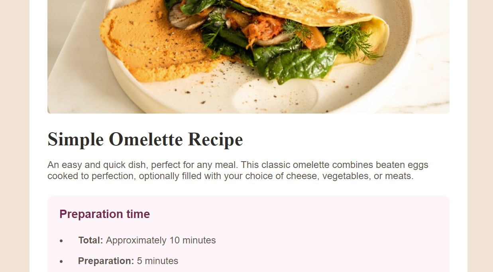

# Frontend Mentor - Recipe page solution

This is a solution to the [Recipe page challenge on Frontend Mentor](https://www.frontendmentor.io/challenges/recipe-page-KiTsR8QQKm). Frontend Mentor challenges help you improve your coding skills by building realistic projects. 

## Table of contents

- [Overview](#overview)
  - [Screenshot](#screenshot)
  - [Links](#links)
  - [Built with](#built-with)

## Overview

Building a responsive website for the Frontend Mentor recipe challenge. 

### Screenshot

### Links

- Solution URL: [Add solution URL here](https://github.com/dhruvshan/Recipe-Page-Frontend-Mentor)
- Live Site URL: [Add live site URL here](https://recipe-page-frontend-mentor.vercel.app/)

### Built with

- Semantic HTML5 markup
- CSS custom properties
- Lots of troubleshooting
